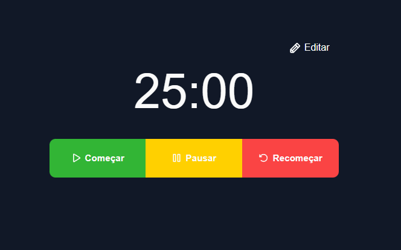

# Pomodoro Timer (web)

This project was made by myself (elmoura) to practice my front-end and VanillaJS skills.

It is a pomodoro timer, with editable counters and a simple UI to control the timer.
The timer itself is at the file `src/timer.js` and the time control logic is there.

Made with love by a back-end engineer learning front-end <333

